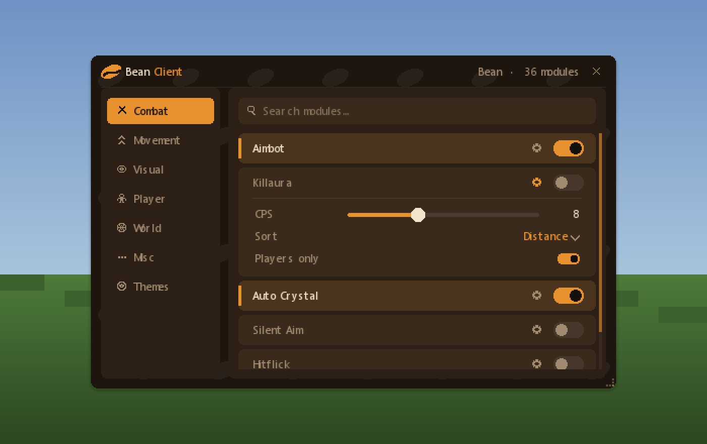
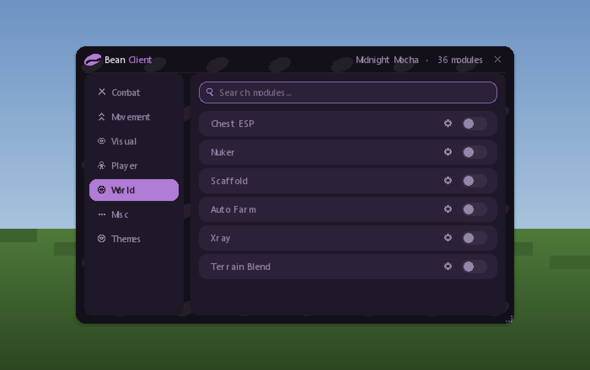

# Bean Client

A bean-themed click-GUI shell for Minecraft **26.2** (Fabric).

This is the *window*, not the client. Everything visual is finished — the category
rail, module rows, settings drawers, live search, drag-and-resize, the open/close
animation and a JSON theming system — and there is deliberately **no module logic
behind any of it**. Every toggle flips a boolean and prints a line to the log.

It exists so that adding a real feature is one call:

```java
ModuleRegistry.registerModule("Fullbright", Category.VISUAL, on ->
        Minecraft.getInstance().options.gamma().set(on ? 15.0 : 0.5));
```

Nothing in `club.bean.client.gui` imports a concrete module, so wiring behaviour in
never means touching render code.

---

## Screenshots

**Combat tab, one settings drawer open.** Rows carry a name, a gear that expands the
drawer, and a toggle. The faint bean wallpaper sits behind the panels.



**Live search.** The box filters as you type and spans every category, so each result
is tagged with where it came from.


**Themes tab.** Pick a theme, drag the accent around the colour picker, and the whole
window re-skins on the same frame. The swatch legend at the bottom is the theme's own
JSON, field by field.


**The same GUI on two other themes** — `classic_dark.json` (no bean motif, tighter
corners, blue accent) and `midnight_mocha.json` (violet, radius 12):

| Classic Dark | Midnight Mocha |
| --- | --- |
|  |  |

---

## What is actually built

| | |
| --- | --- |
| **Open / close** | Right Shift (rebindable under Controls → Bean Client). Esc also closes. |
| **No pause** | The GUI is a `Screen` whose `isPauseScreen()` returns false, so the world keeps ticking underneath. |
| **Animation** | Fade + scale on the way in and out, eased off the wall clock so it looks the same at 20 FPS and 300. |
| **Category rail** | Combat, Movement, Visual, Player, World, Misc, Themes — icon and label each, with selected and hover states. |
| **Module rows** | 6 placeholder rows per category. Name, gear, toggle. Left-click the row toggles it; right-click or the gear opens its drawer. |
| **Settings drawers** | Checkbox, slider and mode-cycler rows. Values persist. |
| **Search** | Filters live across every category. Esc clears, then unfocuses. |
| **Drag / resize** | Drag the title bar; drag the grip in the bottom-right corner. Position and size are saved between sessions. |
| **Theming** | JSON files in a `themes/` folder, switchable in-game with a live colour picker. |

### Why the GUI is drawn from two places

`BeanGuiRenderer` is the only code that draws the window, and two hosts call it:

- **`BeanGuiScreen`** while it is open — it owns mouse and keyboard input.
- **`BeanHudOverlay`**, on Fabric's HUD render hook, for the tail of the close
  animation.

Closing drops the screen immediately so the mouse goes straight back to the game, but
the window still owes you a fade-out. Fabric only extracts HUD elements when no screen
is open, which is exactly the window that needs filling. Both hosts call the same
render method, so the closing window is pixel-identical to the open one.

### Drawing

Minecraft only gives you axis-aligned rectangles, so `Draw` builds everything out of
horizontal spans and merges the runs. A rounded rectangle costs `2 × radius + 1` quads
regardless of height; the bean is one quad per scanline (a rotated ellipse solved as a
quadratic per row) plus a sine-curve crease. Nothing is a texture, so every shape takes
the theme's colours for free.

---

## Build and install

Requires **JDK 25** (Minecraft 26.2 runs on it).

```bash
git clone https://github.com/randomprojects1234/bean-client.git
cd bean-client
./gradlew build
```

The jar lands in `build/libs/bean-client-1.0.0.jar`.

To install: put that jar in your `.minecraft/mods/` folder alongside
[Fabric Loader](https://fabricmc.net/use/) 0.19.3+ and
[Fabric API](https://modrinth.com/mod/fabric-api) for 26.2. Launch, join a world, press
**Right Shift**.

> Minecraft 26.x ships deobfuscated — Mojang stopped publishing obfuscation maps after
> 1.21.11 — so `build.gradle` has no `mappings` dependency and no remap step, and mods
> are ordinary `implementation` dependencies. If you are porting this back to 1.21.x you
> will need to add mappings and switch to `modImplementation`.

---

## Adding a module

Registration is the whole API. In `BeanClient.onInitializeClient()`, or anywhere that
runs during client init:

```java
import static club.bean.client.module.ModuleRegistry.registerModule;

registerModule("Fullbright", Category.VISUAL, enabled -> {
            // your feature goes here
        })
        .description("Ignores world lighting")
        .setting(Setting.slider("Gamma", 15, 1, 20, 0))
        .setting(Setting.toggle("Affect water", false))
        .setting(Setting.mode("Mode", "Gamma", "Nightvision"));
```

- The callback fires on every flip with the new state.
- The name becomes the config key, so `module.fullbright` in
  `config/beanclient/config.json` remembers the toggle across restarts.
- Settings persist too, under `setting.fullbright.gamma` and friends.
- Read a setting back with `module.settings().get(0).value()` /  `.boolValue()` /
  `.modeValue()`.

The placeholder rows live in
[`DefaultModules.java`](src/main/java/club/bean/client/module/DefaultModules.java) —
delete what you do not want and register your own. Nothing else needs changing.

## Adding a category

Add one enum constant to
[`Category.java`](src/main/java/club/bean/client/module/Category.java). The rail, the
search filter and the module list all iterate `Category.values()`, so that is the entire
change:

```java
SCRIPTS("Scripts", new String[] {
        ".........",
        "..#####..",
        ".##...##.",
        "..#####..",
        ".##......",
        ".##......",
        "..#####..",
        ".........",
        "........."
}),
```

The icon is a 9×9 pixel mask — `#` is on, anything else is off. It is drawn by
`Draw.glyph`, which merges each row into as few rectangles as it has runs.

The rail is sized for about seven entries at the default window height; past that,
either make the window taller or shrink `BeanGui.RAIL_ROW_H`.

## Adding a theme

A theme is one JSON file in `config/beanclient/themes/`. The three that ship
(`bean`, `classic_dark`, `midnight_mocha`) are copied out of the jar on first run and
never overwritten afterwards, so editing them in place is fine.

Only five fields are required — the rest are derived from them, so a short file still
looks deliberate:

```json
{
  "name": "Minimal Example",
  "background": "#101010",
  "panel": "#1C1C1C",
  "text": "#EEEEEE",
  "accent": "#22C55E",
  "cornerRadius": 6
}
```

The full set:

| Field | Type | Default if omitted |
| --- | --- | --- |
| `name` | string | Prettified filename |
| `author`, `description` | string | empty — `description` shows on the Themes tab |
| `background` | hex | `#1E150F` |
| `panel` | hex | `background` lightened 6% |
| `panelAlt` | hex | `panel` lightened 6% — row and input backgrounds |
| `text` | hex | `#F2E3CC` |
| `textDim` | hex | `text` mixed 55% toward `panel` |
| `accent` | hex | `#E8912F` — toggles, selection, focus rings |
| `cornerRadius` | 0–20 | `8` |
| `pattern` | `bean` \| `dots` \| `grid` \| `none` | `none` |
| `patternOpacity` | 0–1 | `0.055` |
| `backgroundImage` | `namespace:path` or `null` | `null` |

Colours accept `#RGB`, `#RRGGBB` or `#AARRGGBB`, with or without the `#`.

To use one: drop the file in `config/beanclient/themes/`, open the **Themes** tab and
press **Reload**, then pick it from the dropdown.

The three buttons on that tab:

- **Reset** — drops the accent you picked in-game and goes back to the file's value.
- **Save file** — writes the current theme *including* your picked accent back to its
  own JSON, so the colour becomes part of the theme on disk.
- **Reload** — re-reads the folder without restarting the game.

Files whose name starts with `_` are extracted but hidden from the dropdown — that is
how `_example_minimal.json` stays available as a template without cluttering the picker.

The copies in [`themes/`](themes/) at the repo root are the source of truth; the build
bundles them into the jar.

---

## Layout of the source

```
src/main/java/club/bean/client/
├── BeanClient.java          entrypoint — the whole wiring is ~20 lines
├── BeanKeys.java            the Right Shift binding
├── BeanConfig.java          flat JSON config, debounced writes
├── module/
│   ├── Category.java        the rail tabs + their 9x9 icons
│   ├── Module.java          name, category, boolean, callback
│   ├── Setting.java         toggle / slider / mode
│   ├── ModuleRegistry.java  registerModule() — the seam
│   └── DefaultModules.java  the placeholder rows
├── theme/
│   ├── Theme.java           one skin, parsed with derived defaults
│   ├── ThemeManager.java    loads themes/, tracks the live one
│   └── Colours.java         ARGB + HSV maths
├── gui/
│   ├── BeanGui.java         window state and all the geometry
│   ├── BeanGuiRenderer.java draws the window; owns layout hit-testing
│   ├── BeanGuiScreen.java   input host (isPauseScreen = false)
│   ├── ThemeTab.java        theme dropdown + colour picker
│   ├── Draw.java            rounded rects, the bean, glyphs, widgets
│   └── Anim.java            frame-rate independent easing
└── hud/
    └── BeanHudOverlay.java  HUD host for the close animation
```

## Config

Everything lives under `config/beanclient/`:

```
config/beanclient/
├── config.json     window rect, selected theme, accent overrides, toggles
└── themes/
    ├── bean.json
    ├── classic_dark.json
    ├── midnight_mocha.json
    └── _example_minimal.json
```

## License

MIT — see [LICENSE](LICENSE).
