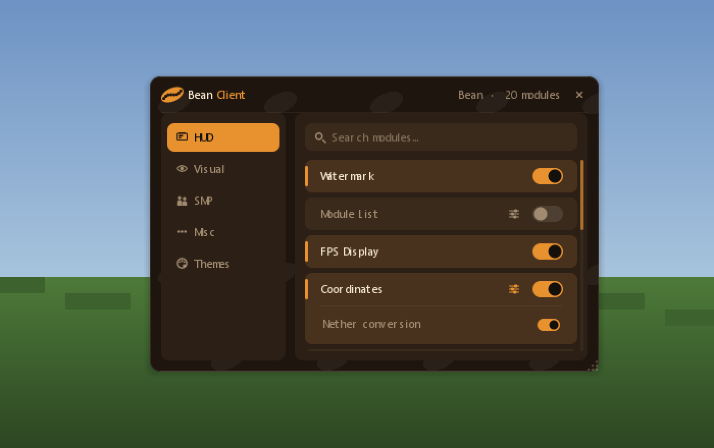
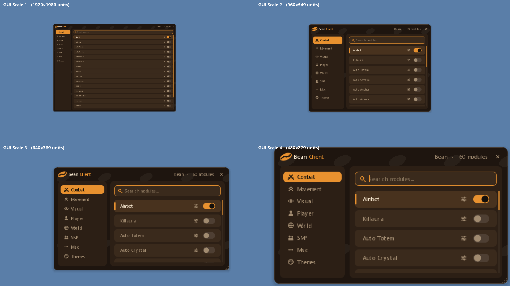
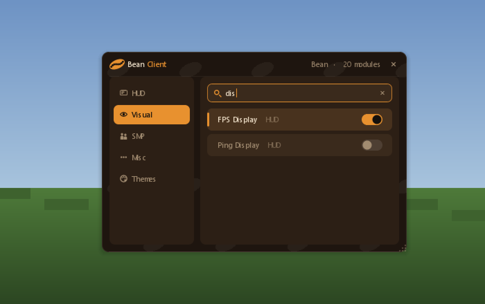
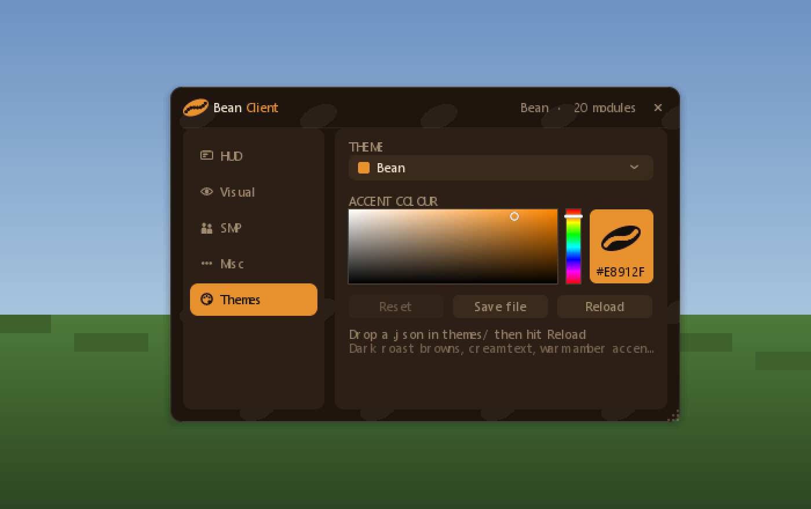
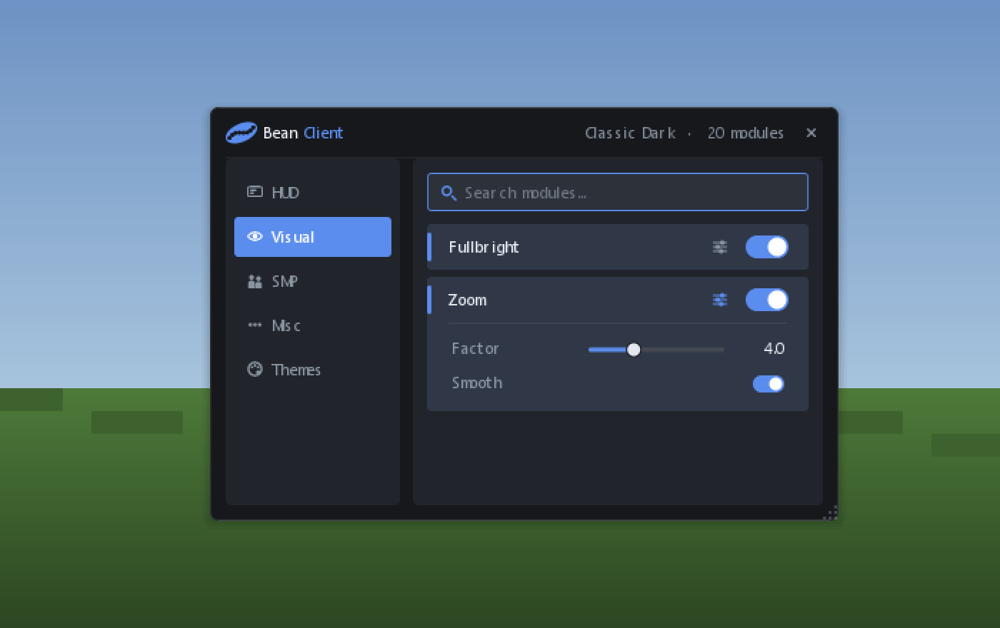
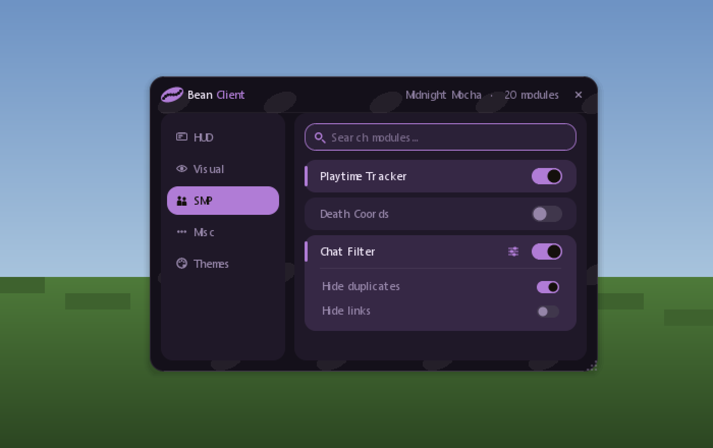

# Bean Client

A bean-themed click-GUI for Minecraft **26.2** (Fabric) — a coffee-coloured in-game
menu you open with Right Shift to browse modules, flip toggles, and re-skin the whole
thing from JSON theme files.

**Every module works.** There is no placeholder list — if a row is in the menu, toggling
it changes something.

They all share one property: each reads state the vanilla client already has and draws it
on your own screen, or flips a vanilla option. Nothing is sent to the server, nothing is
automated on your behalf, and nothing reveals what the game did not already send you.
That is why there is no Combat tab — aim assistance, movement exploits and
see-through-walls rendering only pay off by taking something from the other people on the
server, and they are not going to appear here.



---

## What it does

### Opening it

Press **Right Shift** in-game. The window fades and scales in over about 150 ms.

The game does **not pause** while it is open — the world keeps ticking, mobs keep
moving, exactly like having the chat box up. Press Right Shift again, Esc, or the ×
in the top-right to close it; the window fades back out over the running game.

Right Shift is a normal Minecraft keybind, so you can rebind it under
**Options → Controls → Bean Client**. Rebinding changes the key that closes it too.

### Controls

| | |
| --- | --- |
| **Right Shift** | Open / close |
| **Esc** | Close (or, if you are typing in the search box, clear it first) |
| **Left-click a row** | Toggle that module on or off |
| **Right-click a row**, or click its **settings icon** | Open / close its settings drawer |
| **Type** | The search box is focused when the window opens — just start typing |
| **Scroll** | Scroll the module list |
| **Drag the title bar** | Move the window |
| **Drag the bottom-right grip** | Resize the window |

Where you put the window and how big you made it are saved, along with which tab you
were on, which theme is active, and every toggle and setting. It all comes back the
way you left it next time you launch.

The window sizes itself to your **GUI Scale**. Minecraft's GUI coordinate space is
1920x1080 units at scale 1 but only 480x270 at scale 4, so a window with a size fixed in
those units is either lost on a big screen or larger than a small one. Bean Client takes a
share of whatever space there is, and carries your size across proportionally when you
change the setting:



### The layout

**Title bar** — the bean logo and name on the left; the active theme and the module
count on the right; the close button. Grab anywhere along it to drag the window.

**Category rail** (left) — five tabs, each with an icon: HUD, Visual, SMP, Misc and
Themes. The selected one is filled with the accent colour by a pill that slides between
tabs; hovering lights the others up.

**Module list** (right) — the rows for whichever tab you are on, six per category. Each
row shows its name, a settings icon if it has settings, and a toggle switch. Switching a module
on tints the row, slides the toggle across, and lights an accent bar down its left edge.

**Settings drawer** — click a row's settings icon (or right-click the row) and the row grows
downward to reveal its settings. Three kinds appear:

- **Checkboxes** — a small toggle, on or off.
- **Sliders** — drag the handle; the value shows on the right, and integer sliders snap.
- **Mode cyclers** — click to step forward through the options, right-click to step back.

Settings are remembered between sessions, so a module you wire up later gets its values
restored for free.

**Search box** — filters the list as you type. It searches **every** category, not just
the one you are on, so it doubles as a jump-to; each result is tagged with the category
it came from. The × clears it, and picking a tab clears it too.



### Themes

The **Themes** tab is where the client re-skins itself.



- **The dropdown** lists every theme in your themes folder, each with its own accent as
  a swatch. Pick one and the entire window changes on the same frame.
- **The colour picker** below it changes the accent — the colour used for toggles,
  the selected tab, focus rings and highlights. Drag inside the square for saturation
  and brightness, drag the strip for hue. The preview panel on the right shows the
  colour and its hex code. Everything re-skins live as you drag.
- **Reset** throws away the colour you picked and goes back to what the theme file says.
- **Save file** writes the theme *including* your picked colour back to its own JSON, so
  the colour becomes a permanent part of that theme.
- **Reload** re-reads the themes folder, so you can drop a new file in and use it without
  restarting Minecraft.
- **The swatch legend** at the bottom shows the current theme's fields, labelled with the
  exact JSON keys that produced them — the file format is discoverable from in-game.

Three themes ship with it. Here is the same GUI under the other two — `classic_dark`
(neutral slate, blue accent, tighter corners, no bean motif) and `midnight_mocha`
(violet, radius 12):

| Classic Dark | Midnight Mocha (SMP tab) |
| --- | --- |
|  |  |

The bean theme paints a faint repeating bean silhouette behind the panels; `classic_dark`
turns it off. That is a per-theme setting, not a hardcoded look.

### What the modules do

All twenty, by tab. [MODULES.md](MODULES.md) has the settings, defaults and config keys,
generated straight from the registry so it cannot drift from the code.

**HUD** — readouts drawn on your own screen

| | |
| --- | --- |
| **Watermark** | The Bean Client mark in the corner. |
| **Module List** | Everything you have switched on, either corner. |
| **FPS Display** | Your frame rate. |
| **Coordinates** | Your position, with the matching Nether coordinates. |
| **Ping Display** | Your latency to the server. |
| **CPS Counter** | Clicks per second, left and right. It counts clicks you made — it never makes one. |
| **Speedometer** | How fast you are actually moving, in blocks per second. |
| **Clock** | The real-world time, so you know when to stop. |
| **Session Timer** | How long this session has been running. |
| **Keystrokes** | WASD, the mouse buttons and jump, lit while held. |
| **Armour HUD** | Your armour and held item with durability left. |
| **Effects HUD** | Your potion effects and how long they have. |
| **Server Info** | Which server you are on, and how many players are online. |

**Visual** — how your own client renders

| | |
| --- | --- |
| **Fullbright** | Lifts the brightness floor past the vanilla slider. Lighting only — it cannot show you a block the server never sent. |
| **Zoom** | Hold **C** to narrow your FOV. The same change as moving the FOV slider. |

**SMP** — server quality of life

| | |
| --- | --- |
| **Playtime Tracker** | Counts your time on each server and remembers it between sessions. |
| **Death Coords** | Records where you died and prints it to your own chat. |
| **Chat Filter** | Hides duplicate chat, optionally links. A display filter — nothing is sent back. |

**Misc**

| | |
| --- | --- |
| **FPS Limiter** | Caps your frame rate, and puts the vanilla setting back when you switch it off. |
| **Toggle Sounds** | A click when you toggle a module, pitched up for on and down for off. |

### What is deliberately not here

No aimbot, killaura, auto-crystal, auto-totem or reach. No speed, no-slow, step, velocity
or no-fall. No ESP, chams, x-ray, chest or storage highlighting, freecam, or chunk
analysis for finding bases. Earlier versions listed some of these as placeholder rows;
they are gone rather than left as labels that never do anything.

Those all work by giving you information or actions the game did not hand you, at the
expense of the other people on the server. Everything above works whether or not anyone
else is playing, which is the test.

---

## Install

Requires **Java 25** — Minecraft 26.2 runs on it.

1. Install [Fabric Loader](https://fabricmc.net/use/) 0.19.3 or newer for Minecraft 26.2.
2. Drop [Fabric API](https://modrinth.com/mod/fabric-api) for 26.2 into `.minecraft/mods/`.
3. Drop `bean-client-2.0.0.jar` in there too.
4. Launch, join a world, press **Right Shift**.

Building it yourself:

```bash
git clone https://github.com/RandomAccountGog200/bean-client.git
cd bean-client
./gradlew build
```

The jar lands in `build/libs/bean-client-2.0.0.jar`.

> Minecraft 26.x ships deobfuscated — Mojang stopped publishing obfuscation maps after
> 1.21.11 — so `build.gradle` has no `mappings` dependency and no remap step, and mods
> are ordinary `implementation` dependencies. Porting this back to 1.21.x means adding
> mappings and switching to `modImplementation`.

Everything it writes lives in `config/beanclient/`:

```
config/beanclient/
├── config.json     window position and size, active theme, accent overrides, toggles
└── themes/
    ├── bean.json
    ├── classic_dark.json
    ├── midnight_mocha.json
    └── _example_minimal.json
```

---

## Building on it

### Adding a module

Registration is the entire API. Nothing under `gui/` imports a concrete module, so
adding real behaviour never means touching render code:

```java
import static club.bean.client.module.ModuleRegistry.registerModule;

registerModule("Fullbright", Category.VISUAL, enabled -> {
            // your feature goes here
        })
        .description("Ignores world lighting")
        .setting(Setting.slider("Gamma", 15, 1, 20, 0))
        .setting(Setting.toggle("Affect water", false))
        .setting(Setting.mode("Mode", "Gamma", "Nightvision"));
```

- The callback fires on every flip, with the new state.
- The name becomes the config key, so `module.fullbright` in `config.json` remembers the
  toggle across restarts. Settings persist under `setting.fullbright.gamma` and friends.
- Read values back with `module.settings().get(0).value()` / `.boolValue()` /
  `.modeValue()`.

The placeholder rows are all in
[`DefaultModules.java`](src/main/java/club/bean/client/module/DefaultModules.java) —
delete what you do not want and register your own.

### Adding a category

Add one enum constant to
[`Category.java`](src/main/java/club/bean/client/module/Category.java). The rail, the
search filter and the module list all iterate `Category.values()`, so that is the whole
change:

```java
COMBAT("Combat", new String[] {
        ".........",
        "..#####..",
        ".##...##.",
        "..#####..",
        ".##......",
        ".##......",
        "..#####..",
        ".........",
        "........."
}),
```

That second argument is a 9×9 pixel mask — `#` is on, anything else is off — and it is
the easy path. The seven built-in categories instead pass no mask and are drawn as
vectors in [`Icons.java`](src/main/java/club/bean/client/gui/Icons.java) out of circles,
rings, rotated bars and polygons, which is what keeps them smooth at every GUI scale. To
give your category the same treatment, drop the mask and add a case to
`Icons.category`.

The rail fits about seven entries at the default window height; past that, make the
window taller or shrink `BeanGui.RAIL_ROW_H`.

### Writing a theme

A theme is one JSON file in `config/beanclient/themes/`. The bundled ones are copied out
of the jar on first run and never overwritten, so editing them in place is fine.

Only five fields are required — the rest are derived from them, so a short file still
looks deliberate:

```json
{
  "name": "Minimal Example",
  "background": "#101010",
  "panel": "#1C1C1C",
  "text": "#EEEEEE",
  "accent": "#22C55E",
  "cornerRadius": 6
}
```

The full set:

| Field | Type | Default if omitted |
| --- | --- | --- |
| `name` | string | Prettified filename |
| `author`, `description` | string | empty — `description` shows on the Themes tab |
| `background` | hex | `#1E150F` |
| `panel` | hex | `background` lightened 6% |
| `panelAlt` | hex | `panel` lightened 6% — row and input backgrounds |
| `text` | hex | `#F2E3CC` |
| `textDim` | hex | `text` mixed 55% toward `panel` |
| `accent` | hex | `#E8912F` — toggles, selection, focus rings |
| `cornerRadius` | 0–20 | `8` |
| `pattern` | `bean` \| `dots` \| `grid` \| `none` | `none` |
| `patternOpacity` | 0–1 | `0.055` |
| `backgroundImage` | `namespace:path` or `null` | `null` |

Colours accept `#RGB`, `#RRGGBB` or `#AARRGGBB`, with or without the `#`.

Drop the file in the folder, open the Themes tab, hit **Reload**, and pick it from the
dropdown. Files whose name starts with `_` are extracted but hidden from the picker —
that is how `_example_minimal.json` stays available as a template without cluttering it.

The copies in [`themes/`](themes/) at the repo root are the source of truth; the build
bundles them into the jar.

---

## How it is put together

**Two hosts, one render path.** `BeanGuiRenderer` is the only code that draws the window,
and two things call it. `BeanGuiScreen` — a `Screen` whose `isPauseScreen()` returns
false, which is why the world keeps ticking — draws it and handles input while it is
open. `BeanHudOverlay`, on Fabric's HUD render hook, draws the tail of the close
animation: closing drops the screen immediately so the mouse goes straight back to the
game, but the window still owes you a fade-out, and Fabric only extracts HUD elements
when no screen is open, which is exactly the gap that needs filling. Both call the same
method, so the closing window is pixel-identical to the open one.

**Everything is drawn from rectangles, but nothing looks like it.** Minecraft only hands
out axis-aligned fills, and building curves out of whole pixels is exactly what makes a
hand-rolled GUI look like a staircase. So a shape here is defined by where its edges fall
at a given height ([`Shapes.java`](src/main/java/club/bean/client/gui/Shapes.java)), and
`Draw.shape` samples it four times per pixel row, works out how much of each edge pixel is
really covered, and fades that pixel by the fraction. Interior pixels stay fully opaque
and runs of identical rows collapse into a single rectangle, so a plain rounded panel
still costs about as many draw calls as the naive version did.

Every curve in the client comes off that one filler — rounded corners, toggle knobs,
slider handles, the colour-picker cursor, all seven category icons, and the bean itself
(a rotated ellipse solved as a quadratic per scanline, with an S-curve crease stroked
along its long axis). Nothing is a texture, which is why every shape picks up the theme's
colours for free.

**Animation runs off the wall clock**, not tick counts, so it looks the same at 20 FPS and
at 300 — and keeps animating while the game itself is paused on a server screen. The
window fades, scales and rises on open; the rail's selection pill slides between tabs and
cross-fades the labels as it passes; rows light up on hover, stagger in one after another
when the list changes, and slide their drawers open; toggle knobs land with a bit of
overshoot.

```
src/main/java/club/bean/client/
├── BeanClient.java          entrypoint — the whole wiring is ~20 lines
├── BeanKeys.java            the Right Shift binding
├── BeanConfig.java          flat JSON config, debounced writes
├── module/
│   ├── Category.java        the rail tabs + their 9x9 icons
│   ├── Module.java          name, category, boolean, callback
│   ├── Setting.java         toggle / slider / mode
│   ├── ModuleRegistry.java  registerModule() — the seam
│   └── DefaultModules.java  the placeholder rows
├── theme/
│   ├── Theme.java           one skin, parsed with derived defaults
│   ├── ThemeManager.java    loads themes/, tracks the live one
│   └── Colours.java         ARGB + HSV maths
├── gui/
│   ├── BeanGui.java         window state, geometry, animation clock
│   ├── BeanGuiRenderer.java draws the window; owns layout hit-testing
│   ├── BeanGuiScreen.java   input host (isPauseScreen = false)
│   ├── ThemeTab.java        theme dropdown + colour picker
│   ├── Shapes.java          shape definitions for the filler
│   ├── Draw.java            the anti-aliased filler, plus widgets
│   ├── Icons.java           the vector icon set
│   └── Anim.java            frame-rate independent easing
└── hud/
    └── BeanHudOverlay.java  HUD host for the close animation
```

## License

MIT — see [LICENSE](LICENSE).
